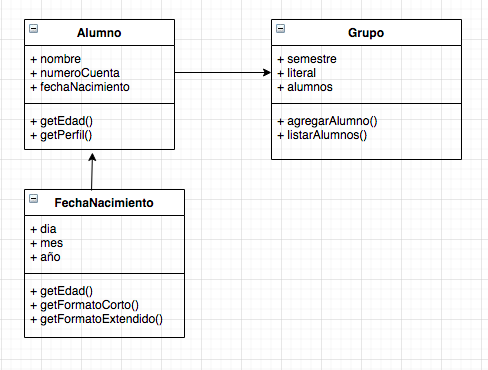

# Conceptos básicos

## Descripción

Demostración de la estructura de un programa utilizando módulos y los conceptos básicos de la Programación Orientada a Objetos

- Clase
- Atributo
- Método
- Método Constructor
- Parámetro
- Objeto

## Diagrama UML

